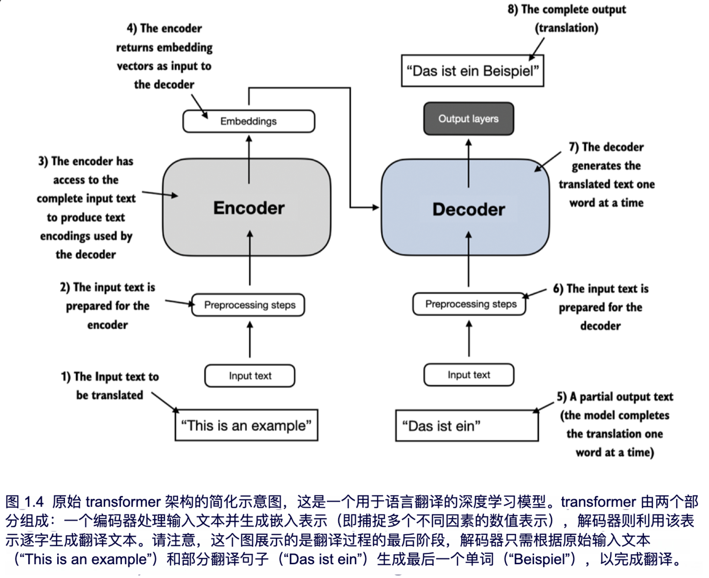

# 大模型0-1

参考资料：[从零构建大语言模型-中译版](https://skindhu.github.io/Build-A-Large-Language-Model-CN/#/)

## Transformer架构

Transformer架构最早于2017年由论文[Attention Is All You Need](https://arxiv.org/abs/1706.03762)提出。这是一种深度神经网络架构，最初为机器翻译开发。下图展示了Transformer架构的简化版本：

这里可以看到我们如今说的Encoder-Decoder架构。其中Encoder用于将所输入的文本向量化并进行深度理解，加工后的文本进入Decoder后，经过输出层转换为目标语言。

## GPT：一种Decoder-Only架构

我们着重关注的GPT系列架构，专注于这个结构中的**Decoder**部分。

为什么GPT不需要Encoder？

当你把一段长文本输入 GPT 时，GPT 的每一层都在对现有的词进行特征提取。虽然它在生成时是单向的，但在处理你的 Prompt（提示词）时，它实际上是在通过层层堆叠的注意力机制，将前面的上下文信息“编码”进当前位置的向量中。**也就是说，GPT 的前N 个 Token 的计算过程，本质上就起到了编码器的作用。**它不再需要一个独立的、双向的 Encoder 模块来生成中间特征。它直接让 **Decoder 模块** 同时承担了“理解输入”和“生成输出”的任务。当你输入 Prompt 时，Decoder 的每一层都在通过 Self-Attention 对你的输入进行特征融合——这个过程在功能上替代了 Encoder，但在架构分类上，它依然属于 Decoder 序列。
