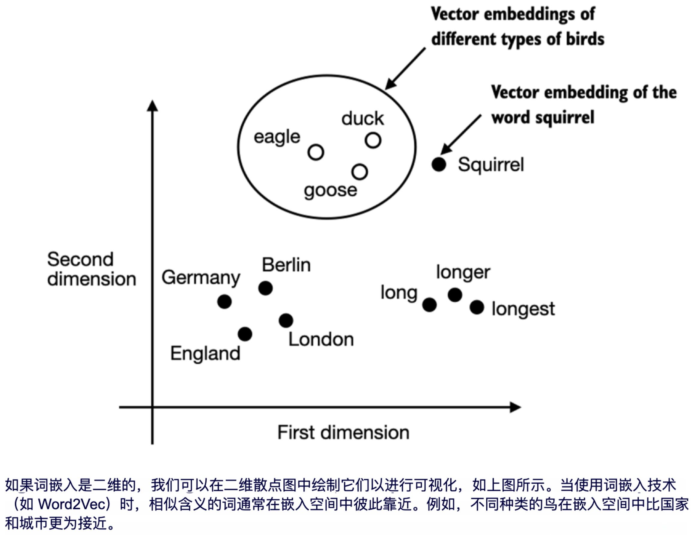

# 分词与Embedding

## 一、概述

> 分词和Embedding的目标：将离散对象（文本、图像、音视频等）映射为对齐的高维向量



## 二、词表与BPE算法：实现词和token id的双向映射

### 2.1 词与token id的关系

设想有一段英文文本raw_text，通过正则获取单个词与标点符号，并遍历将词加入一个map，其下标作为词的id：

```python
# raw_text为加载好的一段英文文本
preprocessed = re.split(r'([,.:;?_!"()\']|--|\s)', raw_text)
preprocessed = [item.strip() for item in preprocessed if item.strip()]
all_words = sorted(set(preprocessed))
vocab = {token:integer for integer,token in enumerate(all_words)}
for i, item in enumerate(vocab.items()):
      print(item)
        
# 输出如下：        
"""
('!', 0)
('"', 1)
("'", 2)
...
('Her', 49)
('Hermia', 50)

"""
```

 这样即可将单词与标点符号映射为id，同时根据id也可以反查到对应的词。这就是一个迷你词表

### 2.2 BPE算法

BPE的核心思想是：**从字符级开始，通过不断合并最常共同出现的字符序列（子词，Subwords），来逐步构建词表。** 这样既能解决未登录词（OOV）问题，又能让词表大小保持在合理范围。

BPE 的训练过程是一个**自底向上**的统计合并过程，主要分为以下几个步骤：

1. **准备原始语料**：收集大量文本，并在每个单词的末尾加上一个特殊的结束符（如 `</w>` 或 ` `），用来区分单词边界。
2. **构建初始词表**：将所有单词拆分为单个字符（或字节），这些字符构成初始的基础词表。
3. **统计频次**：统计语料中相邻字符对（Byte Pairs）出现的总频次。
4. **合并并更新**：选择出现频次**最高**的一个字符对，将它们合并成一个新的子词（Subword），并加入到词表中。
5. **循环迭代**：重复步骤 3 和 4，直到达到预设的**词表大小上限**或**迭代次数**。

BPE（Byte Pair Encoding，字节对编码）最初是一种数据压缩算法，后来被引入到自然语言处理（NLP）中，成为了大语言模型（如 GPT、LLaMA 等）中最主流的分词（Tokenization）算法之一。

它的核心思想是：**从字符级开始，通过不断合并最常共同出现的字符序列（子词，Subwords），来逐步构建词表。** 这样既能解决未登录词（OOV）问题，又能让词表大小保持在合理范围。

### BPE 的核心原理

BPE 的训练过程是一个**自底向上**的统计合并过程，主要分为以下几个步骤：

1. **准备原始语料**：收集大量文本，并在每个单词的末尾加上一个特殊的结束符（如 `</w>` 或 ` `），用来区分单词边界。
2. **构建初始词表**：将所有单词拆分为单个字符（或字节），这些字符构成初始的基础词表。
3. **统计频次**：统计语料中相邻字符对（Byte Pairs）出现的总频次。
4. **合并并更新**：选择出现频次**最高**的一个字符对，将它们合并成一个新的子词（Subword），并加入到词表中。
5. **循环迭代**：重复步骤 3 和 4，直到达到预设的**词表大小上限**或**迭代次数**。

### 💡 一个直观的例子

1. **初始化：BPE会先将句子中每个字符视为一个单独的token**

   ```markdown
   ['T', 'h', 'e', ' ', 'c', 'a', 't', ' ', 'd', 'r', 'a', 'n', 'k', ' ', 't', 'h', 'e', ' ', 'm', 'i', 'l', 'k', ' ', 'b', 'e', 'c', 'a', 'u', 's', 'e', ' ', 'i', 't', ' ', 'w', 'a', 's', ' ', 'h', 'u', 'n', 'g', 'r', 'y']

2. **统计最常见的字节对**

   BPE算法会在这些token中找到出现频率最高的“字节对”（即相邻的两个字符），然后将其合并为一个新的token。例如这里最常见的字节对时（'t', 'h'），因为它在单词"the"和"that"中出现频率较高。

3. **合并字节对**

   根据统计结果，我们将最常见的字节对（'t', 'h'）合并为一个新的token，其它类似

```
['Th', 'e', ' ', 'c', 'a', 't', ' ', 'dr', 'a', 'nk', ' ', 'th', 'e', ' ', 'm', 'i', 'l', 'k', ' ', 'be', 'c', 'a', 'u', 'se', ' ', 'it', ' ', 'wa', 's', ' ', 'hu', 'n', 'gr', 'y']
```

4. **重复步骤2和3，得到最终的token序列**

```rst
['The', ' ', 'cat', ' ', 'drank', ' ', 'the', ' ', 'milk', ' ', 'because', ' ', 'it', ' ', 'was', ' ', 'hungry']
```


下面是一个完整的 BPE 算法核心实现，包含词表训练（获取合并规则）**和**对新文本进行编码（分词）的过程。

```py
import re
from collections import defaultdict

# 1. 准备初始语料频次字典（模拟分词后的单词和频次）
# 末尾添加 '</w>' 标识单词结束
vocab_counts = {
    'l o w </w>': 5,
    'l o w e r </w>': 2,
    'n e w e s t </w>': 6,
    'w i d e s t </w>': 3
}

def get_stats(vocab):
    """统计相邻字符对的频次"""
    pairs = defaultdict(int)
    for word, freq in vocab.items():
        symbols = word.split()
        for i in range(len(symbols) - 1):
            pairs[(symbols[i], symbols[i+1])] += freq
    return pairs

def merge_vocab(pair, vocab_in):
    """将语料中所有指定的字符对进行合并"""
    vocab_out = {}
    # 将 pair 转换为正则表达式，例如 ('t', 'h') -> 't h'
    bigram = re.escape(' '.join(pair))
    p = re.compile(r'(?<!\S)' + bigram + r'(?!\S)')
    
    for word in vocab_in:
        # 替换合并，中间去掉空格
        w_out = p.sub(''.join(pair), word)
        vocab_out[w_out] = vocab_in[word]
    return vocab_out

# 2. 训练阶段：迭代合并
num_merges = 10  # 迭代次数
merges = {}      # 存储合并规则 (pair) -> 'combined'

print("--- 开始训练 BPE ---")
for i in range(num_merges):
    pairs = get_stats(vocab_counts)
    if not pairs:
        break
    # 找出频次最高的字符对
    best_pair = max(pairs, key=pairs.get)
    merges[best_pair] = ''.join(best_pair)
    
    print(f"迭代 {i+1}: 合并最高频组合 {best_pair} (频次: {pairs[best_pair]})")
    vocab_counts = merge_vocab(best_pair, vocab_counts)

print("\n最终训练得到的合并规则 (Merges):", merges)

# 3. 推理阶段：利用学习到的规则对新单词进行分词
def encode(word, merges):
    """对单个新单词进行 BPE 分词"""
    # 初始拆分为单个字符，并在末尾加结束符
    symbols = list(word) + ['</w>']
    
    while len(symbols) > 1:
        # 寻找当前符号列表中，在训练合并规则中最早出现的 pair
        # 优先合并在训练中更早（通常频次更高）的对
        pairs_in_word = [(symbols[i], symbols[i+1]) for i in range(len(symbols)-1)]
        candidates = [p for p in pairs_in_word if p in merges]
        
        if not candidates:
            break  # 没有可以继续合并的规则了
            
        # 选择在 merges 中最早被学到的规则
        best_pair = min(candidates, key=lambda p: list(merges.keys()).index(p))
        
        # 执行合并
        new_symbols = []
        i = 0
        while i < len(symbols):
            if i < len(symbols) - 1 and (symbols[i], symbols[i+1]) == best_pair:
                new_symbols.append(merges[best_pair])
                i += 2
            else:
                new_symbols.append(symbols[i])
                i += 1
        symbols = new_symbols
        
    return symbols

print("\n--- 测试新单词分词 ---")
test_word = "newest"
print(f"'{test_word}' 的分词结果结果: {encode(test_word, merges)}")
```

### tiktoken

实际应用中，可以使用openai基于rust实现的[tiktoken库](https://github.com/openai/tiktoken)

```python
# pip install tiktoken
# 加载模型对应的词表
tokenizer = tiktoken.get_encoding("gpt2")
text = "Hello, do you like tea? <|endoftext|> In the sunlit terraces of someunknownPlace."
# 词->id
integers = tokenizer.encode(text, allowed_special={"<|endoftext|>"})
# id->词
strings = tokenizer.decode(integers)
```

### [进阶：BBPE](#bbpe)


## 三、Embedding层与位置编码：为token添加更丰富的信息

> Embedding层的作用：Embedding 层将用户输入的离散 token 序列转换成模型内部的连续向量表示，并编码位置信息，为后续 Transformer 层的自注意力计算提供可处理的语义基础。它是“从符号到理解”的第一道桥梁。

### 词嵌入：Token Embedding

上一节已介绍了如何将词转换为token id，本节将介绍如何将token id映射为高维向量，以及如何构建token之间的关系。

Transformer架构中，Embedding是这样的一个层：

```py
# 以GPT2为例，词表大小是50257，输出维度是768维
vocab_size = 50257
output_dim = 768
embedding_layer = torch.nn.Embedding(vocab_size, output_dim) 
```

想象这里的embedding_layer是一个50257行，768列的巨大表格。假设此时我们输入的token为 `The cat sat`：

通过 `The` `Cat` `Sat`3个词的token id（通过tiktoken库，使用BPE算法得到），我们从这张巨大表格里查询出这3个词对应的高维向量，得到一个 `[seq_len × hidden_size]` 的浮点矩阵。这一步的作用是将离散符号映射到高维连续空间，相似的词在嵌入空间中距离更近，使模型能利用语义相似性进行预测。

### 位置嵌入：Positional Embedding

词嵌入只是单纯的查表操作，但语句“你爱我”和“我爱你”中，“你”和“我”所表达的语义是不一致的。为给token嵌入这种位置上的语义信息，我们引入位置编码。

在GPT-2中，positional embedding层被设置为如下的一个层：

```py
# context_length为模型所能处理的最大上下文长度。GPT-2的context_length为1024
pos_embedding_layer = torch.nn.Embedding(context_length, output_dim)
```

类似上面介绍的Token Embedding，Positional Embedding也是一个巨大的查找表。对于输入`The cat sat`，模型按这3个token的位置，在Positional Embedding中取出它们的位置信息，并通过相加的方式添加到原有的Token Embedding中：

```python
pos_embeddings = pos_embedding_layer(torch.arange(context_length))
input_embeddings = token_embeddings + pos_embeddings
```

这就是Transformer论文原文中的**绝对位置编码**，给每个位置赋予一个固定或可学习的向量，加到 token embedding 上。其缺点是无法很好外推到训练时未见过的更长序列（外推能力差），且无法显式捕捉 token 之间的相对位置关系。

[绝对位置编码的改良：相对位置编码与旋转位置编码](#rope)

## 拓展

<span id="bbpe"></span>

### BBPE算法

现代的大模型（如 GPT-4, LLaMA）通常使用 **BBPE**。传统的 BPE 初始词表是基于字符的，面对多语言（如中文、日文）时，基础字符集会非常庞大。BBPE 直接将文本视为 **Byte（字节）** 流（一个 UTF-8 字符占 1~4 个字节），基础词表固定只有 256 个字节，然后在这个基础上做 BPE 合并。这使得模型可以轻松实现跨语言的分词，且词表更加紧凑。

#### 前置知识：Unicode编码

> Unicode要解决的核心问题是：**如何让计算机统一表示全世界所有语言的文字符号**。

#### BBPE的基本实现

<span id="rope"></span>

### 相对位置编码

### 旋转位置编码

### 多模态对齐


